# A702 핀테크 특화 프로젝트

# 프로젝트명 : 시시덕

## 팀명 : [A702]
| [강진주]                           | [권민채]                                  | [김예진]                                                 | [김진영]                                                                | [이재홍]                                          | [이주호]                                        |
|---------------------------------|----------------------------------------|-------------------------------------------------------|----------------------------------------------------------------------|------------------------------------------------|----------------------------------------------|
| - 팀장 - 프론트엔드 - 캐싱 - BLE 구현 | - 프론트엔드 - UX/UI 디자인 - UX/UI Lead | - 프론트엔드 - 기획 - UX/UI 디자인 - DB 설계 - API 개발 | - 백엔드 - DB 설계 - API 개발 - Batch처리| - 백엔드 - AI 모델 개발 - 서버 아키텍처 - DevOps| - 백엔드 - 금융망 연동 - 연예인 적금 랭킹 - DevOps |

## 💁‍♂️ Detail Role
[강진주]

팀 일정 관리 및 프로젝트 전체 기획 총괄
메인 화면 UI/UX 개발 및 시니어 사용자 접근성 최적화
BLE 기술을 활용한 주변 팬 탐색 기능 구현
Redis 기반 캐싱 시스템 적용 및 성능 최적화

[권민채]

전체 애플리케이션 UX/UI 디자인 리드
사용자 경험 중심의 인터페이스 설계 및 구현
반응형 웹 컴포넌트 개발 및 스타일 가이드 작성
시니어 사용자를 위한 접근성 향상 기능 적용

[김예진]

프로젝트 초기 기획 및 요구사항 정의
애플리케이션 UI 컴포넌트 설계 및 구현
프론트엔드 API 통신 로직 개발
클라이언트 데이터 모델링 및 상태 관리 최적화
사용자 테스트 및 피드백 반영 주도

[김진영]

백엔드 API 설계 및 구현
데이터베이스 스키마 설계 및 쿼리 최적화
결제 및 거래 처리 시스템 개발
Spring Batch를 활용한 정산 및 배치 작업 구현

[이재홍]

LangChain Agent 기반 AI 챗봇 개발
백엔드 서버 아키텍처 설계 및 구현
클라우드 인프라 관리 및 최적화

[이주호]

금융망 연동 및 통합 
연예인 적금 랭킹 시스템 설계 및 구현
CI/CD 파이프라인 구축 및 배포 자동화

## Languages

## Technologies

## 📝 목차
- [개요](#-개요)
- [Pain Point](#-pain-point)
- [Idea / Solution](#-idea--solution)
- [아키텍처](#-아키텍처)
- [결과물](#-결과물)
- [협업 방식](#-협업-방식)
- [팀의 개발 문화](#-팀의-개발-문화)
- [ERD](#-erd)
- [테스트 및 모니터링](#-테스트-및-모니터링)
- [왜 이 기술을 사용했는가?](#-왜-이-기술을-사용했는가)
- [리팩토링 & 성능 개선](#-리팩토링--성능-개선)
- [성과 및 회고](#-성과-및-회고)

## 📝 개요
시시덕은 시니어 금융 기반 덕질 플랫폼으로, 연예인 적금과 모임 통장을 제공하고 AI 비서(덕순이)를 통해 연예인과 연관된 공감형 대화를 수행하는 서비스입니다. 기존 금융 서비스에 엔터테인먼트 요소를 결합하여 새로운 형태의 팬 활동과 저축 문화를 형성하고자 합니다. 특히 시니어 사용자를 위한 특화된 UX/UI를 제공하여 디지털 금융 접근성을 높이는 것을 목표로 합니다.

## 🧐 Pain Point
1. **기존 은행 앱의 한계**: 기존 은행 애플리케이션은 신뢰성과 보수성이 강해 연예인 적금과 같은 창의적인 시도가 부족합니다.
2. **팬 활동의 경제적 가치화 부재**: 팬들이 좋아하는 연예인을 경제적으로 지원하고 이를 통해 소속감을 느낄 수 있는 공식적인 채널이 부족합니다.
3. **시니어 사용자의 디지털 금융 접근성**: 복잡한 UX/UI로 인해 시니어 사용자들이 디지털 금융 서비스 이용에 어려움을 겪고 있습니다.
4. **팬 커뮤니티 형성의 어려움**: 같은 연예인을 좋아하는 팬들이 오프라인에서 만나고 교류할 수 있는 기회가 제한적입니다.

## 💡 Idea / Solution
### 연예인 적금 시스템
- 좋아하는 연예인을 선택하여 적금 가입
- 응원 메시지와 함께 자율 적금 입금 가능
- 일/주/월별 랭킹을 통한 팬 활동 게임화

### 모임 통장 & 모금 기능
- 특정 목적(이벤트, 생일 등)을 위한 모금 통장 개설
- 목표 금액 설정 및 달성률 시각화
- 모임장 관리 및 중도 해지 로직 구현

### 주변 동료 탐색 기능
- BLE 기술을 활용하여 주변에 같은 연예인 적금에 가입한 팬 탐색
- UUID 변환을 통한 보안 강화
- 오프라인 팬 커뮤니티 형성 지원

### 덕순이 AI 챗봇
- LangChain Agent 기반의 공감형 AI 대화 시스템
- 연예인 정보, 뉴스, 영상 등 맞춤형 정보 제공
- 사용자의 감정을 이해하고 공감하는 대화 능력

### 차별화 포인트
- 금융과 엔터테인먼트의 결합으로 새로운 시장 창출
- 시니어 사용자를 위한 특화된 UX/UI 디자인
- 온/오프라인을 연결하는 팬 커뮤니티 형성
- 실시간 랭킹 및 모금 현황을 통한 참여 동기 부여

## 📈 아키텍처
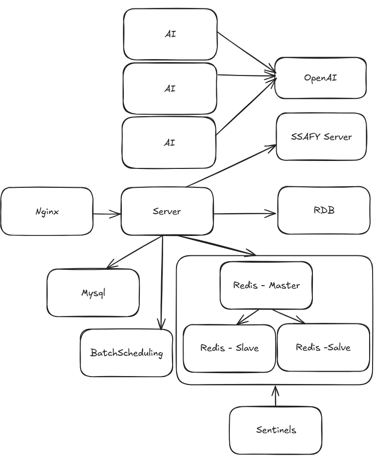

### 시스템 구성
- **프론트엔드**: Kotlin
- **백엔드**: Spring Boot (RESTful API, WebSocket)
- **데이터베이스**: MySQL (주 데이터 저장), Redis (캐싱, 랭킹)
- **인프라**: AWS EC2, S3
- **CI/CD**: Jenkins, Docker, Gitlab Webhook
- **AI**: gpt-4, LangChain Agent

### 핵심 컴포넌트
- **RankingService**: 연예인 및 팬 랭킹 계산 로직
- **RankingWebSocketService**: 실시간 랭킹 업데이트
- **SavingsService**: 결제 및 적금 처리
- **FundingService**: 모임 통장 및 모금 관리
- **BLEService**: 주변 팬 탐색 기능
- **ChatbotService**: LangChain 기반 AI 대화 시스템

### 데이터 흐름
1. 사용자 요청 → Nginx(RoundRobin) -> SpringBoot
2. 연예인 적금 입금 → RankingService 랭킹 재계산 → WebSocket으로 실시간 전송
3. 모금 통장 생성/참여 → FundingService → 목표 달성 시 알림
4. 주변 동료 탐색 요청 → BLEService → UUID 변환 및 매칭
5. 챗봇 질문 요청 → 분기 LLM → Agent or Chat → 결과 반환

### 보안 구조
- JWT 기반 인증/인가
- 민감 정보 노출 최소화
- BLE 통신 시 UUID 변환으로 기기 보안 강화
- 결제 정보 암호화 및 토큰화

## 🎁 결과물
### 메인 화면
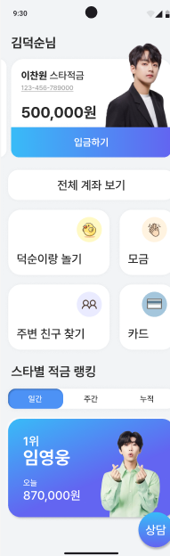
- 메인 페이지로서 연예인 적금 및 여러 기능의 게이트웨이
- 시니어 UX 향상을 위한 확대된 폰트 및 직관적인 아이콘 배치
- 사용자 맞춤형 추천 및 최신 정보 표시

### 모금 통장
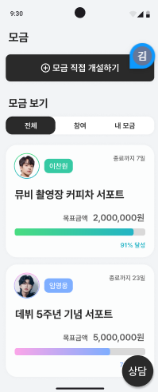
- 연예인 모금 통장 개설 및 목표 금액 설정 기능
- 모금 진행 상황 시각화 및 참여자 목록 제공
- 모임장 교체 및 중도 해지 로직 구현
- Spring Batch를 활용한 Chunk 단위 처리로 대량 데이터 효율적 관리

### 연예인 적금
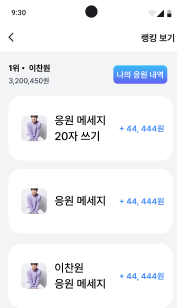
- 연예인별 적금 상품 선택 및 가입
- 이자율 및 만기/중도해지
- 일/주/전체 기간 랭킹 실시간 표시
- 계좌 연결 및 인증

### 주변 동료 탐색 기능
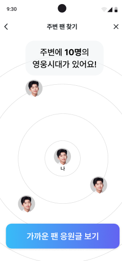
- BLE를 활용한 주변 동료 탐색
- UUID 변환을 통한 기기 보안 강화
- 같은 연예인 적금 가입자 발견 시 알림 및 프로필 표시
- 향후 오프라인 이벤트 및 모임 연계 가능성

### AI 챗봇

- LangChain LCEL을 활용한 유연한 대화 분기 처리
- Agent를 사용해 질문 유형에 따라 최적의 정보 소스 선택
- 연예인 정보, 뉴스, 영상 등 다양한 컨텐츠 제공
- 공감과 정보 전달을 균형있게 제공하는 대화 모델

## ⏰ 협업 방식
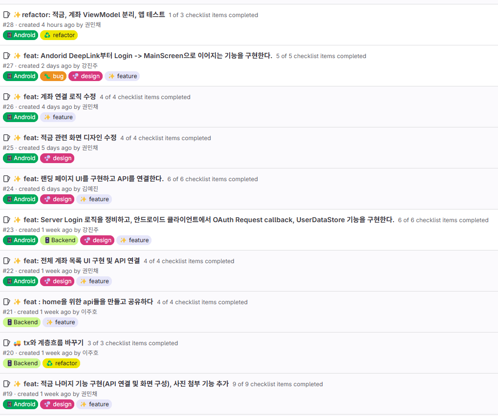

### 일정 관리
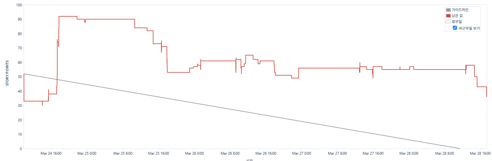
- Jira를 활용한 스프린트 기반 애자일 개발
- 2주 단위 스프린트로 MVP 및 추가 기능 개발 관리
- 일일 스탠드업 미팅으로 진행 상황 공유 및 블로커 해결

### 코드 리뷰 프로세스
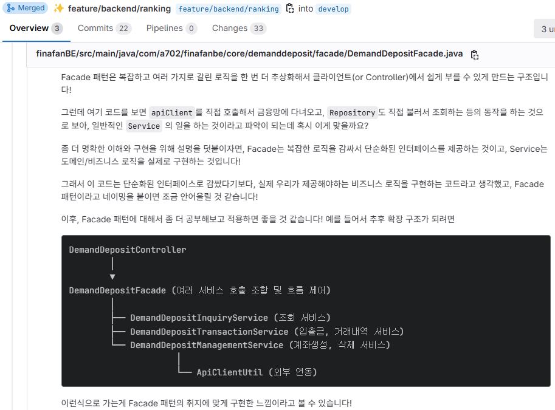
- GitLab MR(Merge Request)을 통한 코드 리뷰
- 최소 1명 이상의 승인 필요
- 코드 컨벤션 준수 및 테스트 코드 필수
- CI 파이프라인 통과 확인 후 병합

### 문서화
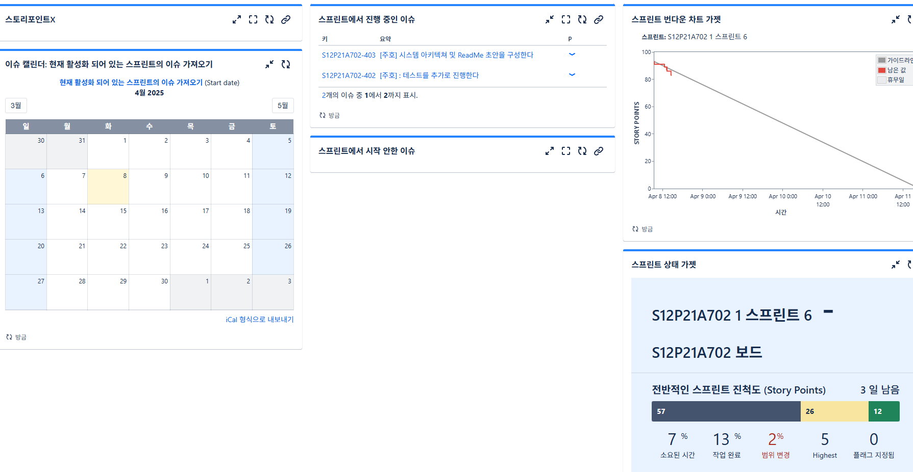
- Confluence를 활용한 기술 문서 및 회의록 관리
- API 문서 자동화 (Swagger)
- 아키텍처 및 플로우 다이어그램 작성

## 🎈 팀의 개발 문화
### 핵심 원칙
- 필요한 내용은 바로 소통을 통해 해결
- 모든 결정사항은 문서화하여 Align 유지
- 문제 발생 시 빠른 공유와 함께 해결책 모색
- 개인의 성장과 팀의 성장을 동시에 중요시

### 소통 방식
- 매일 아침 15분 스탠드업 미팅
- 주 1회 KPT 회고를 통해 개선점 발굴
- 기술적 어려움 발생 시 페어 프로그래밍 활용

### 지식 공유
- 새로운 기술 도입 시 관련 문서화
- 코드 리뷰를 통한 지속적인 피드백

## 📈 ERD
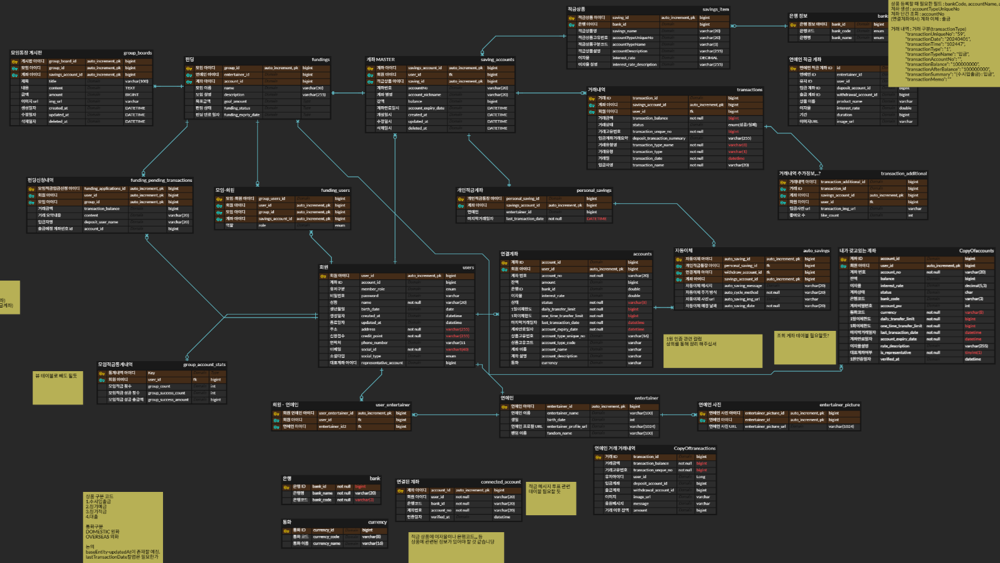

### 주요 엔티티
- **User**: 사용자 정보 및 인증 관련 데이터
- **Entertainer**: 연예인 정보 및 메타데이터
- **Saving**: 연예인 적금 상품 및 가입 정보
- **SavingTransaction**: 적금 입출금 내역
- **Funding**: 모금 통장 정보 및 상태
- **FundingParticipant**: 모금 참여자 및 금액 정보
- **Ranking**: 일/주/전체 랭킹 정보
- **Message**: 응원 메시지 및 댓글

### 주요 관계
- User-Saving: 1:N (한 사용자가 여러 적금 가입 가능)
- Entertainer-Saving: 1:N (한 연예인에 여러 적금 상품 가능)
- User-Funding: N:M (FundingParticipant를 통해 구현)
- Saving-SavingTransaction: 1:N (한 적금에 여러 거래 내역)

## 🔨 모니터링

### 성능 테스트

- JMeter를 활용한 부하 테스트
- 동시 사용자 1,000명 기준 응답 시간 < 500ms 목표
- 랭킹 시스템 실시간 업데이트 성능 검증

### 모니터링 시스템

- Redis-stat을 통한 Redis 캐시 모니터링 //TODO

## 💎 왜 이 기술을 사용했는가?
### Redis Sentinel
- **도입 배경**: 랭킹 시스템의 고가용성과 실시간 데이터 처리 필요
- **대안과의 비교**:
    - Redis Cluster: 수평 확장성은 좋으나 구성 복잡
    - 단일 Redis: 구성 간단하나 SPOF(Single Point of Failure) 문제
    - Redis Sentinel: 고가용성 확보와 구성 복잡도 간 최적의 균형
- **실제 적용 결과**:
    - 마스터 노드 장애 시 자동 장애 조치로 서비스 중단 최소화
    - ZSet을 활용한 효율적인 랭킹 계산 및 조회

### LangChain Agent
- **도입 배경**: 유연하고 확장 가능한 AI 챗봇 시스템 필요
- **대안과의 비교**:
    - 단순 LLM 방식: 구현 간단하나 기능 확장 어려움
    - 단순 RAG 방식: 최신 정보 반영을 위한 작업 필요
- **실제 적용 결과**:
    - 질문 유형을 분석하여 일반 채팅과 질문을 분류하여 처리 속도 향상
    - 다양한 툴로 정보 소스 활용 가능 (뉴스, 영상, 웹 정보 등)
    - 새로운 기능 추가가 용이한 구조

### Spring Batch
- **도입 배경**: 대량의 거래 데이터 처리 및 정산 작업 필요
- **대안과의 비교**:
    - 커스텀 스케줄러: 구현 자유도 높으나 재시도, 오류 처리 등 직접 구현 필요
    - Quartz: 스케줄링에 강점이나 배치 처리 기능 부족
    - Spring Batch: 대용량 처리, 트랜잭션 관리, 재시작 기능 내장
- **실제 적용 결과**:
    - Chunk 기반 처리로 메모리 효율성 향상
    - 실패 지점부터 재시작 가능한 견고한 배치 작업
    - 모금 통장 정산 및 적금 이자 계산 자동화

## 🚀 리팩토링 & 성능 개선
### 랭킹 시스템 성능 개선

- **문제점**: 랭킹 계산 시 DB 부하 증가 및 응답 지연
- **개선 방법**:
    - Redis ZSet을 활용한 랭킹 데이터 캐싱
    - 실시간 업데이트와 배치 업데이트 병행
    - 키 구조 최적화 (일간, 주간, 전체 분리)
- **개선 결과**:
    - 랭킹 조회 응답 시간 ???로 단축
    - DB 부하 ??? 감소
    - 실시간성 확보로 사용자 경험 향상

### BLE 통신 최적화

- **문제점**:
- **개선 방법**:
- **개선 결과**:

## 📌 성과 및 회고
### 프로젝트 성과
- **기술적 성과**:
    - Redis Sentinel을 활용한 고가용성 랭킹 시스템 구축
    - LangChain Agent 기반 AI 챗봇 시스템 개발
    - BLE 기술을 활용한 주변 팬 탐색 기능 구현
    - Spring Batch를 활용한 안정적인 배치 작업 시스템

- **비즈니스 성과**:
    - 핀테크 특화 프로젝트 우수상 수상
    - 시니어 금융과 엔터테인먼트의 결합이라는 새로운 비즈니스 모델 제시
    - 팬 활동의 경제적 가치화 가능성 증명

### 배운 점
- **기술적 측면**:
    - 대용량 데이터 처리 및 캐싱 전략
    - 실시간 시스템 구축 및 최적화 방법
    - AI 기술과 기존 서비스의 효과적인 통합
    - 모바일 기기 하드웨어(BLE) 활용 경험

- **협업 측면**:
    - 애자일 방법론의 실제 적용 및 개선
    - 효과적인 기술 문서화 및 지식 공유 방법
    - 다양한 백그라운드를 가진 팀원 간 소통 개선

### 아쉬운 점 & 개선 방향
- **한계점**:
    - LLM 모델의 응답 속도 개선 필요
    - 모바일 기기별 BLE 구현 차이로 인한 호환성 문제
    - 대규모 사용자 테스트 부족

- **추후 개선 방향**:
  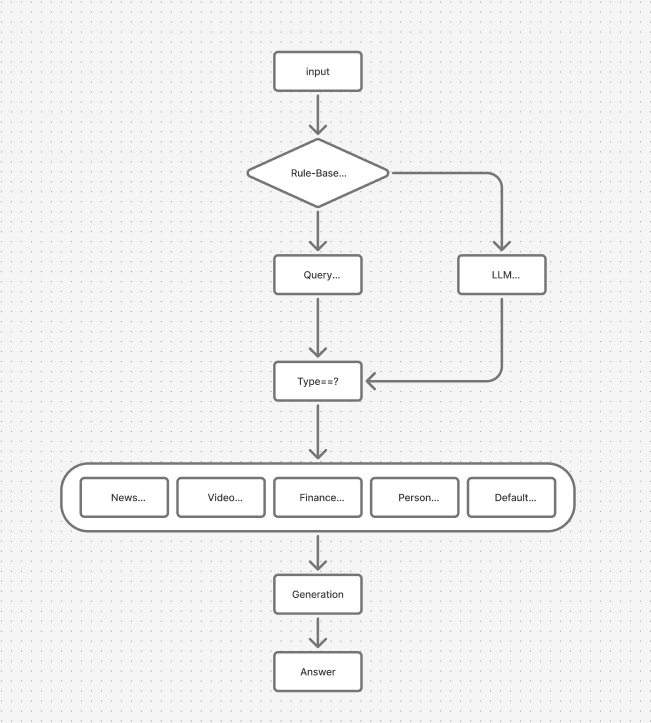
    - 오프라인 이벤트 연계 기능 강화
    - 모임 통장 기능 확장 (목표 달성 시 자동 기부 등)
    - 다양한 연예인 계약 및 제휴 모델 개발

### 시연 영상
[시시덕 시연 영상 링크](https://youtu.be/example)

